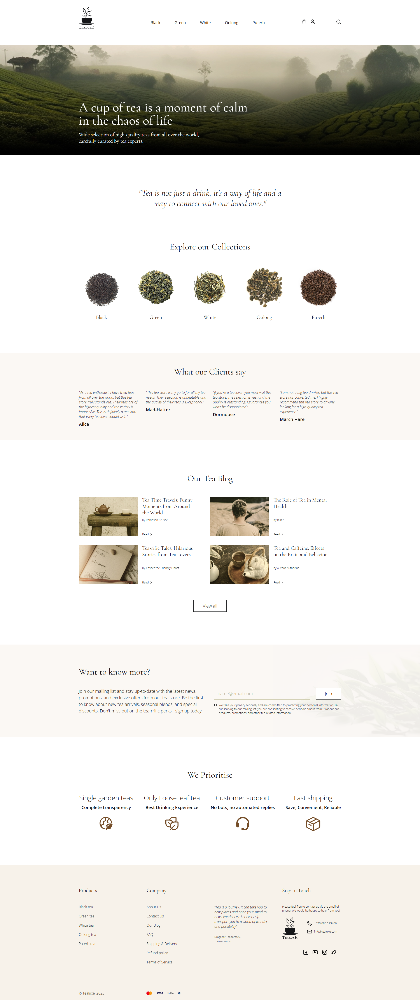

# TeaStore - HTML & CSS Practice Project

This project, **TeaStore**, is a responsive website created as a practice exercise for developing skills in HTML and CSS. It features a clean, modern design for a fictional tea store, "TealuxE".

## Preview

  
*Preview of the TeaStore*

## Features

- **Homepage** featuring a welcoming banner and a brief message about the tea store.
- **Navigation** with links to various tea categories (Black, Green, White, Oolong, Pu-erh), including a mobile-friendly menu.
- **Product Section** displays types of teas with images, providing a user-friendly browsing experience.
- **Customer Reviews** section with testimonials from fictional customers.
- **Blog Section** with articles on tea-related topics.
- **Subscription Form** for a mailing list to keep customers informed about news and offers.
- **Footer** with additional links and contact information.
- **JavaScript Enhancements** for interactive navigation functionality.

## Technologies Used

- **HTML** for structuring the content.
- **CSS** for styling and layout, including custom fonts, responsive design, and media queries.
- **JavaScript** for light interactivity in the navigation menu.
- **Google Fonts** for typography.